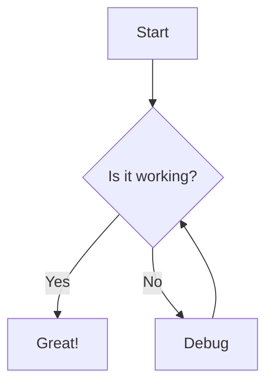

<!-- Logo -->
<p align="center">
  
</p>

<h1 align="center">Markdown → PDF & DOCX Converter</h1>

<p align="center">
  A professional offline Chrome extension that transforms Markdown into polished PDF and editable DOCX documents.
  <br/>
  <b>No backend, fully offline, premium via Chrome Web Store.</b>
</p>

<p align="center">
  <a href="#features">Features</a> •
  <a href="#installation">Installation</a> •
  <a href="#usage">Usage</a> •
  <a href="#examples">Examples</a> •
  <a href="#contributing">Contributing</a>
</p>

---

## Features

- **GitHub Flavored Markdown** – headings, lists, tables, blockquotes, code blocks
- **Live math rendering** with KaTeX – inline `$E=mc^2$` and display-mode `$$\int_0^\infty$$`
- **Mermaid diagrams** – flowcharts, sequence diagrams, graphs – rendered as sharp SVGs
- **Syntax highlighting** for code blocks (Python, JavaScript, Java, C++, Bash, etc.)
- **10 professional fonts** – Inter, Roboto, JetBrains Mono, and more
- **PDF export** – uses browser print engine for vector‑quality output (A4 / Letter)
- **DOCX export** – fully editable Word documents with embedded SVGs and tables
- **100% offline** – all processing happens locally, no data leaves your machine
- **Clean, icon‑driven UI** – minimal text, easy to use for non‑technical audiences
- **Premium via Chrome Web Store** – one‑time purchase, verified by Google sign‑in, no ads ever

---

## Installation

### Quick start (for users)

1. [](https://chromewebstore.google.com/detail/eodfihaikienehbnbgngpgffnagcmede?utm_source=item-share-cb)
2. Pin the extension to your toolbar.
3. Paste Markdown → choose a font → click **Export PDF** or **DOCX**.  

### Build from source (for developers)

```bash
git clone https://github.com/Danyalkhattak/markdown-converter.git
cd markdown-converter
npm install
node setup.js   # downloads all required libraries into extension/libs/
```

Then load the `extension` folder as an **unpacked extension** in Chrome:

1. Go to `chrome://extensions`
2. Enable **Developer mode**
3. Click **Load unpacked** and select the `extension` folder

---

## Usage

1. Click the extension icon in the toolbar.
2. Paste your Markdown (or click the selection button to grab text from the current page).
3. Choose a font from the dropdown.
4. Click **PDF** to export a document that opens in a new tab and auto‑triggers print.
5. Click **DOCX** to download a fully editable `.docx` file.

**Settings** (gear icon) allow you to:

- Change the default font and export format
- Switch code theme (light/dark)
- Toggle Mermaid diagram and KaTeX math rendering

---

## Supported Markdown Features

| Feature          | PDF | DOCX |
|------------------|-----|------|
| Headings         | ✓   | ✓    |
| Bold / Italic    | ✓   | ✓    |
| Lists            | ✓   | ✓    |
| Tables           | ✓   | ✓ (native Word tables) |
| Code blocks      | ✓ (highlighted) | ✓ (monospaced) |
| Blockquotes      | ✓   | ✓    |
| Inline math `$...$` | ✓ (KaTeX) | fallback text |
| Block math `$$...$$` | ✓ (KaTeX) | fallback text |
| Mermaid diagrams | ✓ (SVG) | ✓ (embedded SVG) |

---

## Examples

### Mermaid Flowchart





Renders as a sharp vector graphic in both PDF and DOCX.

### LaTeX / KaTeX

Inline: The mass–energy equivalence formula is $E=mc^2$.

Display:

```latex
$$
\int_{-\infty}^{\infty} e^{-x^2} dx = \sqrt{\pi}
$$
```

All math is rendered using KaTeX – no server required.

### Markdown Table


| Language | Speed | Popularity |
|----------|-------|------------|
| Python   | Fast  | Very high  |
| Rust     | Fast  | Growing    |
| JavaScript | Fast | Very high  |


Tables become real Word tables in DOCX, not images.

---

## Contributing

We welcome improvements, bug fixes, and new feature ideas.  
Here’s how to contribute:

1. **Fork** the repository.
2. Create a new branch: `git checkout -b feature/amazing-feature`
3. Make your changes (keep the code clean and well‑commented).
4. Test locally: load the `extension` folder as an unpacked extension.
5. Commit and push: `git commit -m "Add amazing feature"`
6. Open a **Pull Request** describing what you’ve done and why.

### Development guidelines

- The extension is written in plain JavaScript, HTML, and CSS – no build step.
- All third‑party libraries are downloaded via `setup.js` into `extension/libs/` (do not commit them).
- The `"key"` field in `manifest.json` should only be used for local development and **never** committed to the public repository (we maintain a separate `manifest.dev.json` for that).
- UI changes must remain icon‑based and minimal; avoid adding emojis or long text.

---

## License

This project is licensed under the [MIT License](./docs/LICENSE).  
Premium features are unlocked via a legitimate Chrome Web Store purchase.

---

<p align="center">
  Made with ❤️ for students, developers, and technical writers worldwide by Danyal Khattak.
</p>

